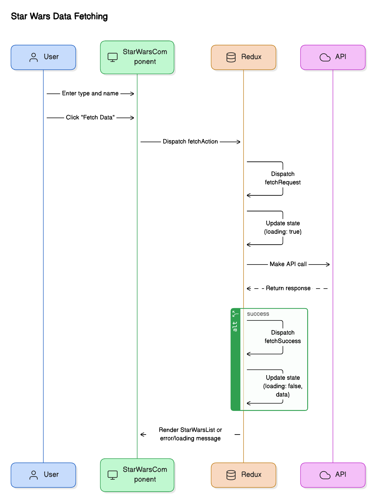

# Star Wars React App

This project is a React application for fetching and displaying Star Wars data.

## Getting Started

To get a local copy up and running follow these simple steps.

### Prerequisites

- Node.js (v14.x or later)
- npm or yarn

### Installation

1. Clone the repo
   ```sh
   git clone https://github.com/your-username/star-wars-react-app.git


 ### Sequence diagram  



 ### Sequence diagram explanation 


1. User Interaction: The user interacts with the StarWarsComponent by entering a type and name in the input fields and clicking the "Fetch Data" button.

2. Dispatch Action: When the button is clicked, handleFetchData is called, which dispatches the fetchStarWarsData action.

3. Action Creator: The fetchStarWarsData action creator dispatches fetchStarWarsRequest to indicate the loading state.

4. API Call: The fetchStarWarsData action creator makes an asynchronous API call to fetch the Star Wars data.

5. API Response:

If the API call is successful, fetchStarWarsSuccess is dispatched with the fetched data.
If the API call fails, fetchStarWarsFailure is dispatched with the error message.

6. Reducer Update: The starWarsReducer handles the dispatched actions and updates the state accordingly:

FETCH_STARWARS_REQUEST sets loading to true.
FETCH_STARWARS_SUCCESS sets loading to false and updates data with the fetched data.
FETCH_STARWARS_FAILURE sets loading to false and updates error with the error message.
Component Re-render: The StarWarsComponent re-renders based on the updated state:

If loading is true, a loading message is displayed.
If error is present, an error message is displayed.
If data is available, the StarWarsList component is rendered with the fetched data.